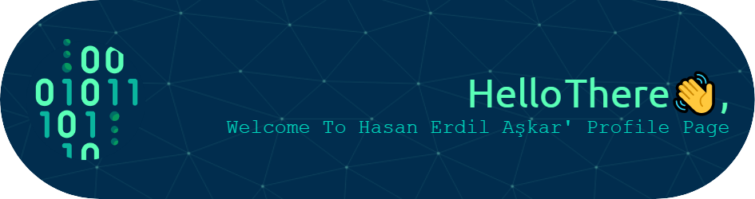

<!--
<h1 align="center"> Hello There 👋, Welcome To Hasan Erdil Aşkar's Profile Page
</h1> 
-->
Hacettepe University 2nd year undergraduate student. Currently focused on mobile development, building apps with Flutter framework. Looking to leverage my experience including different fields. 

<h1 align="center">
  

</h1>
<!--
**erdilhasan/erdilhasan** is a ✨ _special_ ✨ repository because its `README.md` (this file) appears on your GitHub profile.

Here are some ideas to get you started:

- 🔭 I’m currently working on ...
- 🌱 I’m currently learning ...
- 👯 I’m looking to collaborate on ...
- 🤔 I’m looking for help with ...
- 💬 Ask me about ...
- 📫 How to reach me: ...
- 😄 Pronouns: ...
- ⚡ Fun fact: ...
-->
